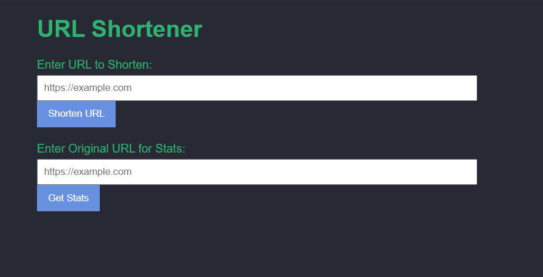
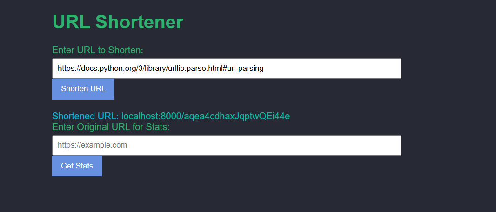
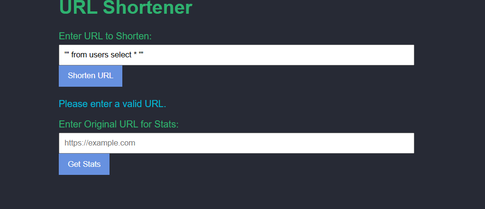
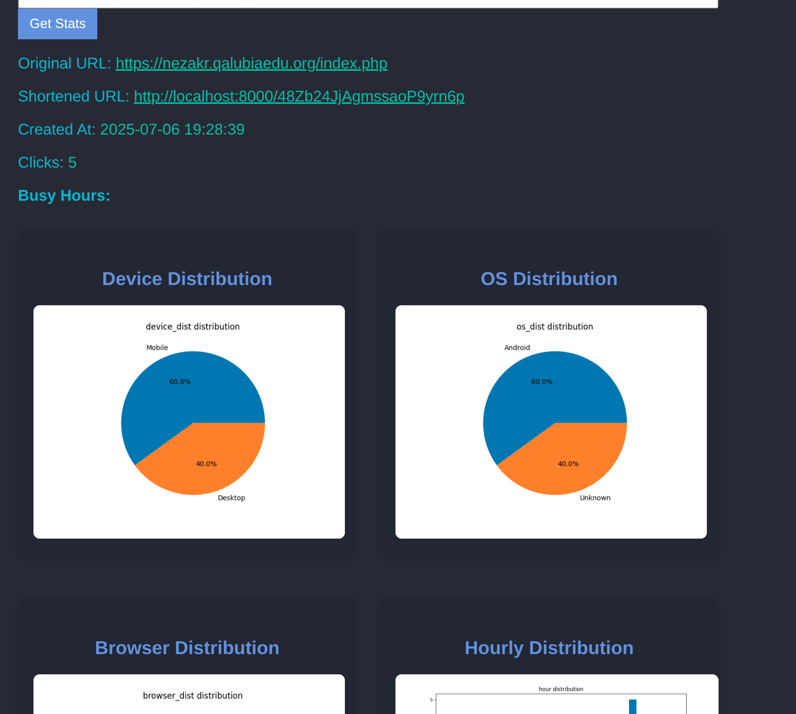

# URL Shortener

A simple, modern, and privacy-friendly URL shortener built with FastAPI and a clean JavaScript frontend. Easily shorten URLs, track visits, and visualize analytics with beautiful charts.

---

## Features

- **Shorten URLs**: Instantly generate short links for any valid URL.
- **Analytics**: View detailed stats for each short link, including:
  - Total clicks
  - Device, OS, and browser distribution (pie charts)
  - Hourly, daily, and monthly visit patterns (bar charts)
  - Busy hours (peak usage times)
- **Input Validation**: Ensures only valid URLs are accepted.
- **Privacy**: No user tracking beyond basic analytics. (User DB and auto-cleanup coming soon!)

---

## Getting Started

### 1. Clone the repository
```sh
git clone <your-repo-url>
cd url_shortner
```

### 2. Install dependencies
```sh
pip install -r requirements.txt
```

### 3. Start the backend
- On Windows: Double-click `start.bat` or run it in your terminal.
- On Linux/Mac: Run the FastAPI server manually:
```sh
uvicorn app.main:app --reload
```

### 4. Open the frontend
- Open `index.html` in your browser.

---

## Usage Walkthrough

### Main Page


### Shorten a URL


### Input Validation


### View Stats & Analytics
- See total clicks, original/shortened URLs, creation date, and interactive charts:


---

## To-Do
- [x] Shorten URLs
- [x] Click tracking
- [x] Frontend integration
- [x] Input validation
- [ ] User database
- [x] Analytics & charts
- [x] Integrate stats with frontend
- [ ] Auto-delete stats folder after logout


